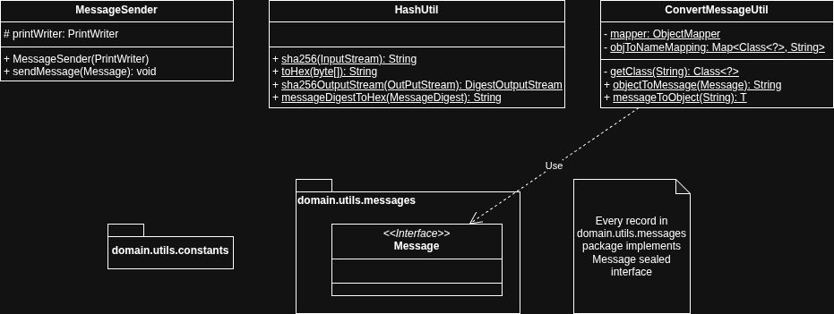
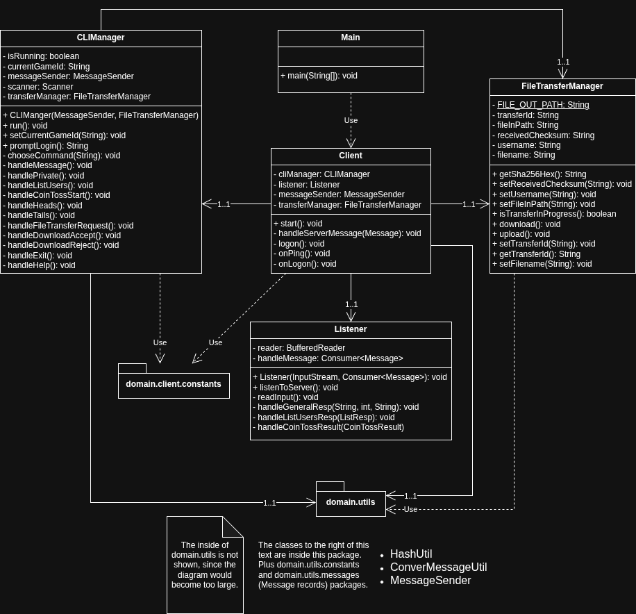
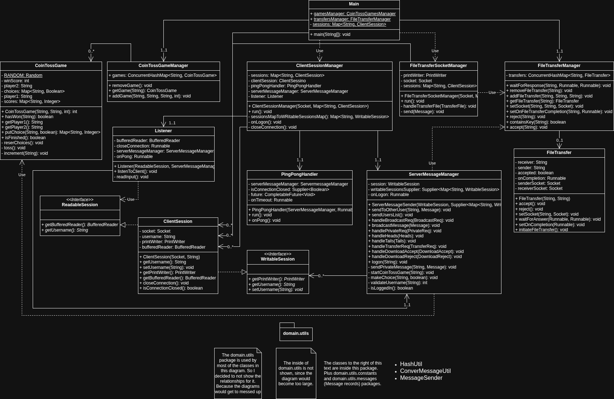

# Utils class diagram



I decided to put hte Utils class diagram first, 
because in the other 2 diagrams it is represented as just a package 
to prevent the Client and Server class diagram from becoming too large.

The MessageSender class is in the Client and in the Server is extended to be ServerMessageManager.

HashUtil is for all the sha256 hashing. It is only used by the client.

ConvertMessageUtil is class that was provided with the tests and I liked the idea, 
so I used it for my client and server implementations.
Also, I decided to replace the Object usage with a sealed Message interface 
which every message class in domain.utils.messages implements.

I don't think there is much to say about constants in general, so in this and other diagrams I just showed them as a package.

# Client class diagram



At the center of the Client class diagram is the Client class. 
It has 1 instance of the following classes: 
CLIManager (left), Listener (bottom), FileTransferManager (right) and MessageSender (from [Utils class diagram](#utils-class-diagram)).
This class is for the most part responsible for handling every command from the server after it gets through Listener class.

CLIManager is responsible for handling every user command, 
that is why there are so many methods in it that start with "handle".
It also gets passed an instance of MessageSender and FileTransferManager from the Client class.

Listener is responsible for getting all the messages from the server and 
converting them to output understandable to the user.
It also passes some of the command to the Client class 
via the ```handleServerMessage(Message)``` method found in the Client class.
The Client class then changes some internal logic depending on which command was sent.

FileTransferManager is responsible for everything that has to do with file transfer. 
It has the main ```upload()``` nad ```download()``` methods. 
It also stores all the information related to file transfer.
Additionally, this class uses HashUtil class from domain.utils package.

As for domain.utils package itself. 
I decided to not show the insides of it, 
since the diagram would become too large then.
You can see more about utils package in [Utils class diagram](#utils-class-diagram).

# Server class diagram



This one is a bit larger than the previous 2. 
But what can I do, server just has more responsibilities.

Let's start with Main class. 
It acts as a way to connect between the client
by having a synchronized Map of username to ClientSession, a CoinTossGameManager and FileTransferManager.
The sessions get passed to the ClientSessionManager and FileTransferSocketManager.
Both of these classes are created by Main when a new user socket (1337) or fileTransfer socket (1338) is created by the client.

ClientSessionsManager declares PingPongHandler, ServerMessageManager and Listener.

PingPongHandler is responsible for keeping the Ping-Pong heartbeat going and closing the connection 
when the Pong response is not received.

Now, about the ClientSession class, and ReadableSession and WritableSession interfaces.
ClientSession is just a class that stores some information like socket, username, printWriter and bufferedReader.
The reason ReadableSession and WritableSession exists is that I felt like giving Listener 
and ServerMessageManager entire ClientSessions is a bit too much.

Onto the Listener class, this class is responsible for getting all the incoming commands from 1 single client.
It also has a ServerMessageManager instance passed to it from the ClientSessionsManger, 
because most of the user messages require the server to client some sort of response, 
whether it is positive or negative.

The ServerMessageManager is where all the messages get sent to the client. 
For that it has a supplier that gets it a Map of username to WritableSession.
And a single WritableSession which is the one client that it is responsible for.
The supplier of Maps is used to send messages to all the other clients.
For example, when this client wants to broadcast something.
Additionally, ServerMessageManager uses FileTransferManager to
be able to transfer a file between 2 client.
Moreover, it uses CoinTossGameManager and CoinTossGame to be able 
to hold a game between 2 clients.

Lastly, the domain.utils package is only shown here to know that 
it is being used by most of the classes here.
No relationships to it are shown because the diagram would 
most likely become too large and confusing.
You can find most on the insides of domain.utils package in [Utils class diagram](#utils-class-diagram).